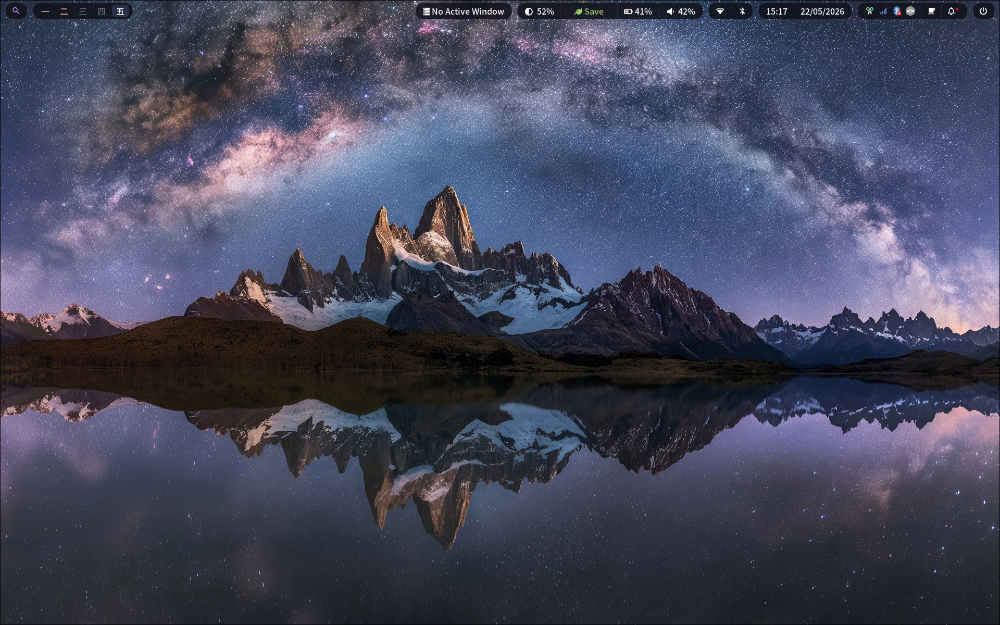

# My Dotfiles

My personal dotfiles for Arch Linux, managed using [GNU Stow](https://www.gnu.org/software/stow/).



## Pre-configuration

1. Install stow

   ```bash
   sudo pacman -S stow
   ```

2. Then clone this repo

   ```bash
   git clone https://github.com/Swellshinider/dotfiles.git ~/.dotfiles
   cd ~/.dotfiles
   ```

3. Stow any package that you want, example:

   ```bash
   stow hypr
   ```

4. Install and initialize the theme manager after stowing the desktop packages:

   ```bash
   stow .local hypr kitty alacritty waybar swaync wofi wlogout gtk
   themectl install
   ```

## Installing packages (optional)

Execute this to install all the recommended packages:

```bash
cd ~/.dotfiles/install/
source install.sh
```

Or you can just check the files in **[install](./install/)** directory to get whatever you want.

## Theme manager

`themectl` manages full desktop themes stored in [`themes/`](./themes/). It keeps the tracked dotfiles stable and generates the active theme under `~/.local/state/themectl/active`.

Common commands:

```bash
themectl menu
themectl list
themectl apply default
themectl preview default --timeout 30
themectl new my-theme
themectl doctor
```

The default keybinding is `Super+Shift+T`.

More detail lives in [`docs/theme-manager.md`](./docs/theme-manager.md).

## Setup zsh as default shell (optional)

```bash
chsh -s $(which zsh)
```

## Easy

Just reboot your system and test!

```bash
sudo reboot
```
